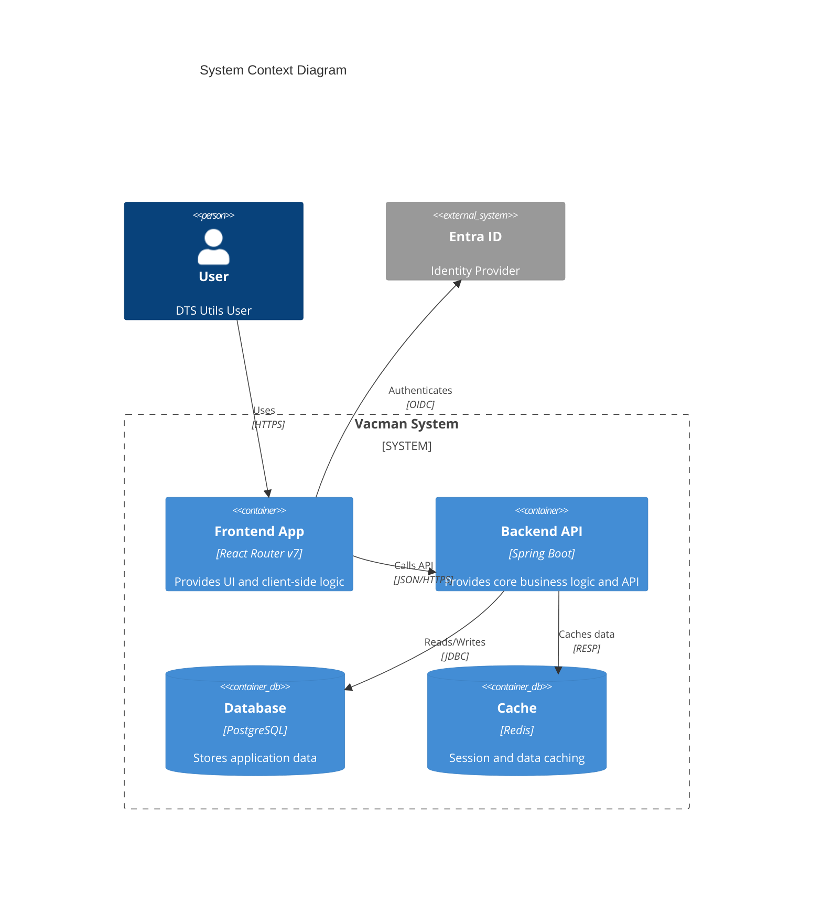
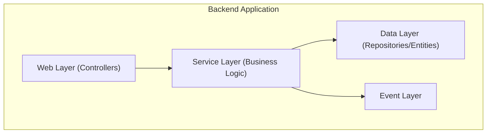

# Project Architecture Blueprint

**Generated:** January 7, 2026
**Project Type:** Java Spring Boot & React Router (Hybrid)
**Architecture Pattern:** Layered Architecture (Backend) / Component-Based (Frontend)

## 1. Architecture Detection and Analysis

### Technology Stack
The project utilizes a split-stack architecture comprising a Java Spring Boot backend and a React/TypeScript frontend.

**Backend Stack:**
- **Framework:** Spring Boot 4.0.1
- **Language:** Java 21
- **Build Tool:** Maven
- **Database:** PostgreSQL (inferred from container config)
- **Key Libraries:** DataFaker, Spring Boot Starters

**Frontend Stack:**
- **Framework:** React Router v7 (Remix successor)
- **Language:** TypeScript
- **Build Tool:** Vite
- **Styling:** Tailwind CSS
- **State/Data Fetching:** TanStack Query (React Query)
- **Telemetry:** OpenTelemetry
- **Testing:** Vitest, Playwright

**Infrastructure & DevOps:**
- **Containerization:** Docker
- **Orchestration:** Kubernetes (K8s) via Kustomize
- **IaC:** Terraform & Terragrunt
- **CI/CD:** Custom Kotlin-based scripts (TeamCity or similar)

### Architectural Pattern
- **Backend:** **Layered Architecture**. The codebase is organized by technical layers (`web`, `service`, `data`), isolating concerns between presentation (API), business logic, and data access.
- **Frontend:** **Route-Centric Component Architecture**. The application is structured around routes (`app/routes`), leveraging the React Router v7 data loading and action primitives for full-stack capable UI logic.

## 2. Architectural Overview

The system operates as a **Monolithic Frontend + Monolithic Backend** pair, deployed as separate containers but tightly integrated via REST APIs.

- **Separation of Concerns:** The backend serves as a pure REST API, handling business logic, persistence, and security enforcement. The frontend handles all UI rendering, client-side routing, and orchestration of user interactions.
- **Boundaries:** The primary architectural boundary is the HTTP/JSON interface between the React application and the Spring Boot API.
- **GitOps Principle:** Deployment configurations are managed declaratively in the `gitops` folder, separating application source code from environment configurations.

## 3. Architecture Visualization

### High-Level Container Diagram



### Backend Layered Architecture



## 4. Core Architectural Components

### Backend Components (`ca.gov.dtsstn.vacman.api`)
- **Web Layer (`/web`)**: Contains REST Controllers. Responsible for handling HTTP requests, input validation, and mapping responses to DTOs.
- **Service Layer (`/service`)**: Encapsulates business logic. Transaction boundaries are typically defined here.
- **Data Layer (`/data`)**: Contains JPA Entities and Repositories. Responsible for database interactions.
- **Event Layer (`/event`)**: Handles asynchronous events or domain events within the application.
- **Security (`/security`)**: Configures authentication and authorization mechanisms (likely Spring Security).

### Frontend Components (`app/`)
- **Routes (`/routes`)**: The core structural unit. Each route module typically defines `loader` (data fetch), `action` (mutations), and `default` (component) exports.
- **Components (`/components`)**: Reusable UI widgets shared across routes.
- **Domain (`/domain`)**: Contains shared domain constants and potentially types.

## 5. Architectural Layers and Dependencies

**Strict Layering Rule:**
1. **Web Layer** depends on **Service Layer**.
2. **Service Layer** depends on **Data Layer**.
3. **Data Layer** has no dependencies on upper layers.
4. **Cross-Cutting** packages (`json`, `config`, `security`) can be used by all layers.

**Dependency Injection:**
Spring's IoC container is used to manage lifecycle and injection of components (`@Service`, `@Controller`, `@Repository`).

## 6. Data Architecture

- **Primary Store:** Relational data in PostgreSQL.
- **Caching:** Redis is configured for caching (found in `gitops/nonprod/base/redis` and `gitops/prod/configs/redis`), likely for session storage or expensive query caching.
- **Migrations:** SQL initialization scripts exist (`backend/other/container/init.sql`), suggesting migration management (possibly Liquibase or Flyway, or manual init for dev).

## 7. Cross-Cutting Concerns Implementation

- **Authentication/Authorization:**
    - Integrated with **Entra ID** (implied by `infrastructure/terraform/entra-app`).
    - Backend likely uses Spring Security with OAuth2 Resource Server to validate tokens.
    - Frontend utilizes OpenID Connect (OIDC) flows.
- **Logging & Observability:**
    - OpenTelemetry is integrated into the frontend (`entry.client.tsx`, `package.json`), enabling distributed tracing.
    - Backend likely has similar instrumentation (typical for modern Spring Boot stacks in this environment).
- **Configuration:**
    - **Backend:** `application.yaml` profiles (`application-local.yaml` seen).
    - **Frontend:** Environment variables and Vite configuration.

## 8. Service Communication Patterns

- **Synchronous:** The Frontend communicates with the Backend via synchronous HTTP REST calls.
- **API Design:** Resource-oriented URLs (e.g., `/api/v1/resources`).
- **Data Format:** JSON.

## 9. Technology-Specific Architectural Patterns

### Spring Boot Patterns (Backend)
- **Controller-Service-Repository**: The standard triad for separation of concerns.
- **Configuration Properties**: Type-safe configuration mapping in `config` package.
- **Global Exception Handling**: Likely implemented via `@ControllerAdvice` in the `web` layer.

### React Router/Vite Patterns (Frontend)
- **Loaders & Actions**: Utilizing the framework's data loading mechanisms rather than `useEffect` for fetching data.
- **File-Based Routing**: Directory structure in `app/routes` dictates the URL structure.
- **Tailwind Utility First**: Styling is applied directly in markup via utility classes (`tailwind.css` present).

## 10. Implementation Patterns

- **Frontend Data Fetching:** Usage of `query-client.ts` indicates the use of TanStack Query for advanced caching and state management on the client details, possibly wrapping the React Router loaders or working alongside them.
- **Infrastructure as Code:**
    - **Terragrunt**: Used to keep Terraform configuration DRY (`infrastructure/terragrunt`).
    - **Kustomize**: Used for overlay-based Kubernetes configuration management (`gitops`), allowing base configurations to be patched for specific environments (dev, prod).

## 11. Testing Architecture

- **Backend:**
    - Unit and Integration tests in `src/test/java`.
    - Likely uses `spring-boot-starter-test`.
- **Frontend:**
    - **Unit/Component Tests:** Vitest (`vitest.config.ts`, `tests/`).
    - **E2E Tests:** Playwright (`playwright.config.ts`, `e2e/`).

## 12. Deployment Architecture

- **GitOps Workflow:**
    - Changes to `main` trigger CI (TeamCity/Kotlin scripts).
    - CI builds Docker images.
    - Deployment manifests in `gitops` repo (or folder) are updated.
    - ArgoCD (or similar controller) syncs the cluster state to the manifests.
- **Environments:** Use of overlays `dev`, `int`, `uat`, `prod` in `gitops/nonprod/overlays` and `gitops/prod`.

## 13. Extension and Evolution Patterns

- **Adding a New Feature:**
    1.  **Backend:** Create Entity -> Repository -> Service Method -> Controller Endpoint.
    2.  **Frontend:** Create Route -> Define Loader/Action -> Create View Component.
- **Scaling:**
    - Stateless backend allows horizontal scaling (HPA configured in `gitops/prod/hpas.yaml`).
    - Frontend static assets served via efficient web server/CDN logic.

## 14. Architectural Pattern Examples

### Layer Separation (Backend)

```java
// Controller (Web Layer)
@RestController
@RequestMapping("/api/vacancies")
public class VacancyController {
    private final VacancyService vacancyService;

    public VacancyController(VacancyService vacancyService) {
        this.vacancyService = vacancyService;
    }

    @GetMapping("/{id}")
    public ResponseEntity<VacancyDto> getVacancy(@PathVariable UUID id) {
        return ResponseEntity.ok(vacancyService.findVacancy(id));
    }
}

// Service (Business Logic Layer)
@Service
public class VacancyService {
    private final VacancyRepository vacancyRepository;

    public VacancyDto findVacancy(UUID id) {
        // Business logic, mapping, etc.
        return vacancyRepository.findById(id)
            .map(VacancyMapper::toDto)
            .orElseThrow(() -> new ResourceNotFoundException("Vacancy not found"));
    }
}
```

### Route Component (Frontend)

```tsx
// app/routes/vacancies.$id.tsx
import { useLoaderData, Form } from "react-router";
import type { Route } from "./+types/vacancies.$id";

// Loader: Runs on server (or client) to fetch data
export async function loader({ params }: Route.LoaderArgs) {
  const vacancy = await getVacancy(params.id);
  return { vacancy };
}

// Component: Renders the UI
export default function VacancyDetail() {
  const { vacancy } = useLoaderData<typeof loader>();
  
  return (
    <div className="p-4">
      <h1 className="text-2xl font-bold">{vacancy.title}</h1>
      <p>{vacancy.description}</p>
    </div>
  );
}
```

## 15. Architecture Governance

- **Linting & Formatting:**
    - `eslint.config.mjs` and `prettier.config.mjs` enforce code style and quality standards globally and per project.
- **Type Safety:** TypeScript in Frontend and Java's strong typing in Backend ensure interface contracts are respected.

## 16. Blueprint for New Development

### Development Workflow
The typical development workflow involves running the frontend and backend applications locally:

1.  **Backend Dev:** Run the backend using Maven:
    ```bash
    mvn spring-boot:run
    ```
2.  **Frontend Dev:** Run the frontend development server:
    ```bash
    pnpm dev
    ```

### Common Pitfalls to Avoid
- **Leaking Logic:** Avoid putting business logic in React components; keep it in the Backend Service layer or, if UI-specific, in React Router actions/loaders.
- **Direct Database Access:** Never access the database directly from Controllers. Always go through the Service layer.
- **Ignoring Types:** Do not use `any` in TypeScript. Define interfaces for API responses in `domain` or local types.
